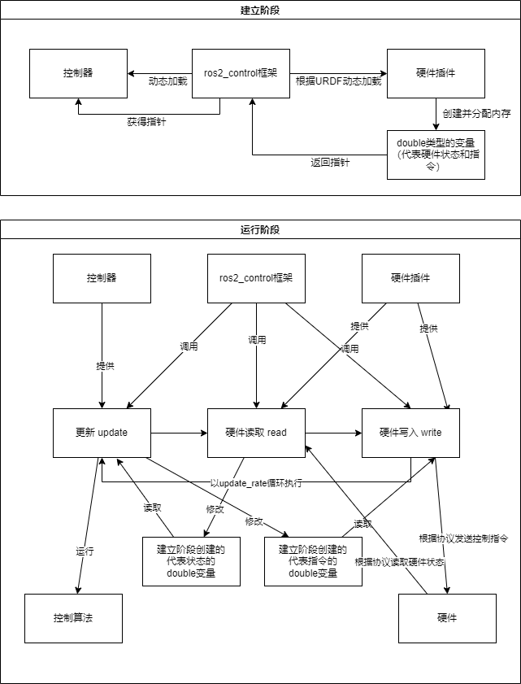

# 关于ROS2 Control的简单理解

首先简单理解实时性，实时性指的是任务完成的确定性，也就是一次循环完成时间的确定性。循环可能每一次事件很长或者很短(平均循环时间可用performance性能来表示)，但是必定能在限定的时间（如1s+-1ms或者1ms+-10us）中完成.普通的网络通信，如ros2采用的dds或者我们上网的tcp/udp通信并不保证实时性可能有随机的突然比较大的延迟或者突然特别小的延迟，发送一次消息的事件也较长（最多可能只有900-1000hz），不利于机器人进行高频率的实时通信，限制了控制器的性能（控制器频率和控制效果呈正相关）

ros2_contro是一个用于机器人实时控制的框架，相比于使用节点和话题通信（网络通信）的主框架，ros2_control给控制器以及硬件通信程序提供了一个分开的统一的零拷贝接口（数据不需要在电脑中走网络或通过CPU从一个地方拷贝到另一个地方），同时提供了realtime_tools包装层，新建一条线程用于处理非实时的ROS2网络通信，能够很好地处理实时性与扩展性的要求。

## 基础架构

整个ROS2 control的框架可以参考ros2_control的doc

controller manager根据param参数文件（提供链接库名与控制器名的对应关系 [参考此链接controller_manager子项](https://github.com/ros-controls/ros2_control_demos/blob/master/ros2_control_demo_bringup/config/rrbot_modular_actuators.yaml)）以及service请求（就是ros2 control load xxx命令，内部实际上是调用controller manager的service）加载控制器（形式为Linux下的动态链接库.so，可以理解为加载之前不需要知道这个库在干什么，但是可以使用函数名调用so里面的使用字符串指定的函数，实现了统一的可替换的插件接口接口），提供interface给控制器，同时向resource manager请求所有的硬件接口

resource manager根据[urdf文件](https://github.com/ros-controls/ros2_control_demos/blob/master/ros2_control_demo_description/rrbot_description/ros2_control/external_rrbot_force_torque_sensor.ros2_control.xacro)加载不同的hardware插件，形式同样为动态链接库。其可以包括sensor system actuator类型。其实就是sensor只包括只读接口，actuator只包括写入指令接口，system可以读写。一个hardware插件可以包含多个不同类型的接口

通过控制器与硬件插件两者分别的动态加载 实现了控制器与实际机器人硬件的解耦合并且实现中间的信息高效流动

关于动态加载如果还不太清楚可以看看操作系统提供的api的实现，其实就是：

找到so文件 -> 动态加载文件(`dlopen`) -> 根据函数名字符串查找函数(或者是动态库里面的数值之类的任何符号)`dlsym`的指针 -> 取得函数指针之后运行即可

好像在C++里面还基于此包装了另外一种更方便的动态加载机制，插件继承插件基类，基类提供虚函数api，加载插件只需要把插件当成插件的基类对象调用即可，反正原理最终和上面一致

整个运行流程除去包装可以认为是如下形式

## 硬件接口层

需要实现硬件的`read` `write`以及`export_command/state_interface`（上图中返回指针）几个函数。还有一个读取硬件信息（hw info）的`configure`函数，因为同一个hardware插件只对应不同类型的hardware。hardware的内部配置，有几个等信息都写在URDF内，ros2control将其转化为hardware info类传入configure。

如果硬件很复杂，还可以实现`prepare_command_mode_switch`、`start`、`stop`等函数，在不同阶段额外执行操作

详细编程[教程参考](https://control.ros.org/master/doc/ros2_control/hardware_interface/doc/writing_new_hardware_interface.html)

## 控制器层

需要实现 `init` `update` `on_configure` `update` `command_interface_configuration` `state_interface_configuration`(取得指针)等

详细编程[教程参考](https://control.ros.org/master/doc/ros2_controllers/doc/writing_new_controller.html)

## 机器人组件（URDF）

[参考](https://control.ros.org/master/doc/getting_started/getting_started.html#hardware-components)

## 快速创建ros2_control包模板

官方文档里面链接失效了 应该是[这个](https://github.com/StoglRobotics/ros_team_workspace/tree/foxy) 不会用建议先自己探索一下并且修改一下他报错的地方。用这脚本确实挺麻烦
